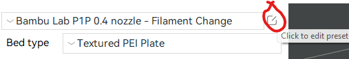
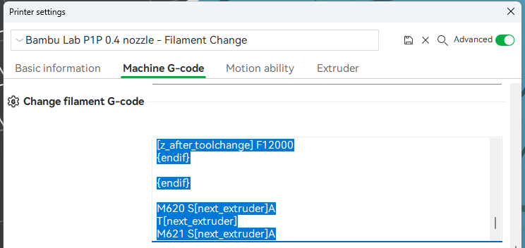

# bambu-a1-manual-filamant-change
### What is this

Manual filament change GCode for bambu lab a1 without AMS

### How to use

Click to edit the preset circled below, and then insert the piece of code below into the top of "Change filament G-code".

**Be cautious!** I only test a few times and it works fine. Be careful while test it on your printers.

(The pictures are from [reddit](https://www.reddit.com/r/BambuLab/comments/11gtlfp/change_filament_gcode_without_ams/))
